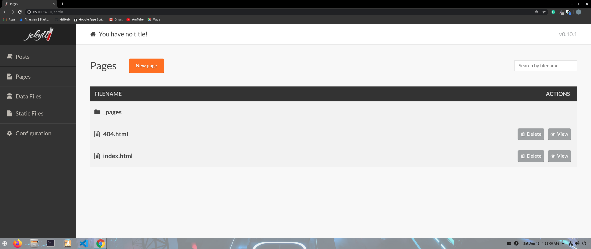
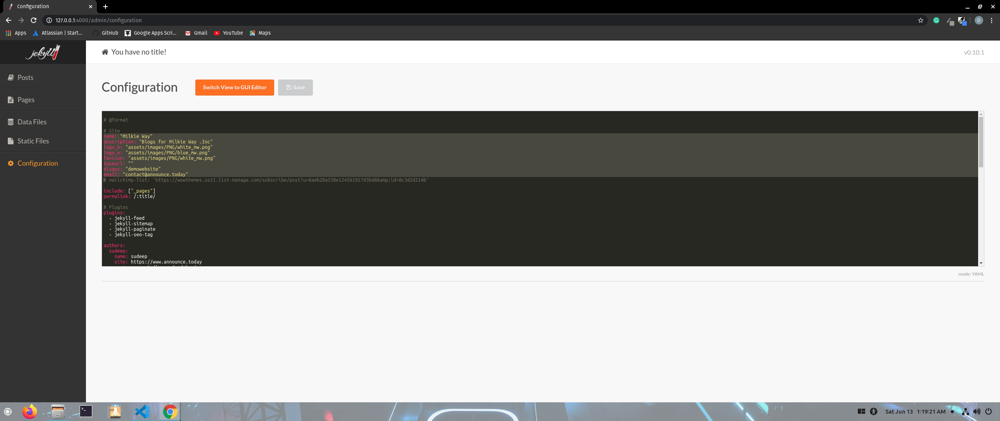
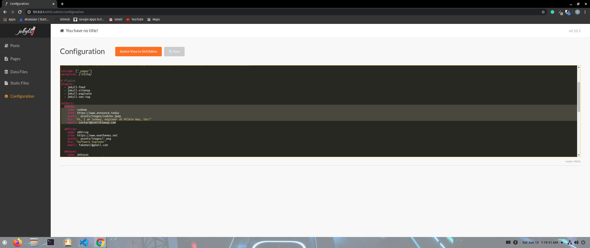
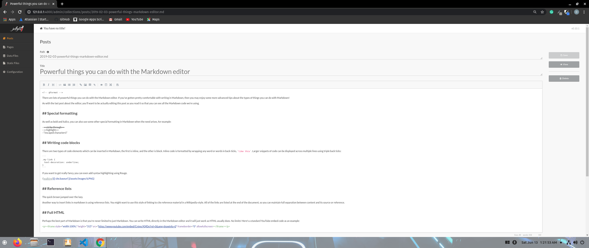
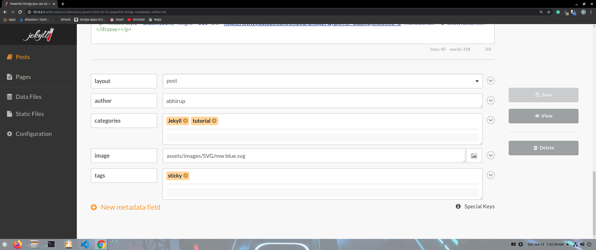

## Blog Template

### Visit
http://community.blog.mentro.tech

## To run locally:

(make sure you have the dependencies installed, like Ruby, bundle etc.)

1. fork the repository
2. git clone
3. cd mentro-blog
4. bundle exec jekyll serve
5. go to the link _http://127.0.0.1:4000/_ in your browser

## how to Commit

1. bundle exec jekyll build ***Don't Forget To Run This***
2. git add .
3. git commit -m "Comment"

## Editting

Run the Server and go to the following URL

> http://127.0.0.1:4000/admin

Will be displayed

**_Remember Restarting the Server After Updating the Config_**

### Editting Site Configs

- **Click on Configuration**

- **Change the Configs in the Highlighted Portion**

  - logo_b - refers to logo for the dark theme.
  - logo_w - refers to logo for the light theme.
  - favicon - refers to the favicon.
  - email - should be contact eamil.

- **Remember Restarting the Server After Updating the Config**

### Adding Authors

- **Click on Configuration**

- **Copy an Author Layout and paste it under the author as given in the image**

  - name - name of author.
  - site - some site if the author has some.
  - avatar - relative an image from the assets/images directory.
  - bio - A short bio.
  - email - A contact email specific to the author

- **Remember Restarting the Server After Updating the Config**

### Adding Posts

- **Click on Posts**

- **Add Title to the Post**

- **In the body section Create a post using Markdown**

- **Below the post there is a add metadata portion. Add Metadata there**

  - **layout** - post
  - **author** - The sub fileld under author that resembles you
  - **categories** - Enter the categories under which your post matches
  - **image** - relative URL to the image that forms the main image of the post. The URL must be a relative url from assets/image
  - **tags** - The tags under which the post will be visible

- **Don't Forget to click on save**

### Adding/Removing images

- **Click on Static Files**
- **Select Assets then images the ngo to the directory where you want to upload**
- **Click on the Upload files button to Upload an image**
- **Hover on any image to see the X ,clicking on which deletes an image.**

## Understanding the File Structure

### \_includes

This mostly contains files which are related to UI and is not of much importance if you don't want to make major UI changes.

### \_layouts

1. default.html - This is the layout loaded by all pages It contains the Navbar and the basic structure of the web pages
2. page.html - This is the layout for the contents of **\_pages** folder. Each page mentioned here holds the details of each author and their post history
3. page-sidebar.html - This is the layout for the contents of **\_pages** too.
4. post.html - This is the layout the **\_posts** in the blog.

### \_pages

1. about.md - This is the abouts page
2. author-jane.html, author-sal.html, .. - These are individual pages for each author
3. author-list - This page displays the list of authors
4. categories.html - this displays the categories of all blogs present Ex. Tutorial, Announcement etc
5. contact.md - It is the contacts page
6. privacy-policy.md - These are the Company's Privacy Policies
7. tags.html - These are tags to each blogs or Categories

### \_site

This folder is constantly updated and consists of the compiled version of HTML CSS and other Resources

### assets

This folder consists of assets such as css, images and js

### \_config.yml

This is a config file. **Any changes in this file needs a restart to the server to get reflected** in the website.
This consists of some site variables like links to (logos, baseurl, sitename etc) and author info

### index.html

This is the home page of the repository

## General Tips

1. Make Sure You are mot making any changes in the \_site folder, as the site folder is generated automatically bases on the other folders. Hence all the changes made will be lost with just a server restart.

2. Make sure you provide relative urls to every variable. The URL bust be relative to the base url.

3. If you want to change some color shade or highlight for all buttons(According to the themes) please consider copying the HEX code of the color, then find-replace all occourances of the color with the required change in both **theme.css** and **main.css**
 